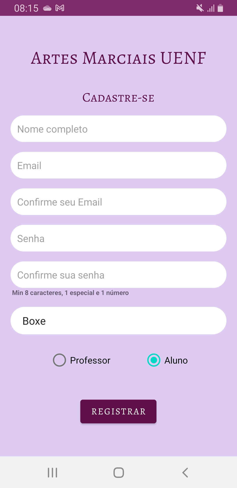

# **ArtesMarciaisUENF** 🥋

Este é um aplicativo Android desenvolvido para gerenciar postagens e informações relacionadas a modalidades de artes marciais oferecidas pela UENF. O aplicativo permite que os usuários façam postagens com imagens, visualizem detalhes sobre aulas e instrutores, e se mantenham atualizados sobre os eventos de artes marciais.

## **Sumário**
- [Funcionalidades](#funcionalidades)
- [Instalação](#instalação)
- [Tecnologias Utilizadas](#tecnologias-utilizadas)
- [Estrutura do Projeto](#estrutura-do-projeto)
- [Contribuições](#contribuições)
- [Licença](#licença)

---

## **Funcionalidades**

- 📋 **Postagens**: Os usuários podem publicar posts com título, conteúdo, e imagens.
- 🖼️ **Upload de Imagens**: Upload de imagens diretamente da galeria ao criar uma nova postagem.
- 🥊 **Informações das Aulas**: Visualize informações sobre aulas, incluindo horários, instrutores e localização.
- 🔔 **Notificações**: Receba notificações sobre novos eventos e atualizações.
- 📱 **Interface Responsiva**: Layout otimizado para diferentes tamanhos de tela.

---

## **Instalação**

### **Pré-requisitos**
Antes de começar, certifique-se de ter os seguintes itens instalados em sua máquina:

- [Android Studio](https://developer.android.com/studio)
- SDK do Android
- Emulador ou dispositivo físico para testes

### **Passos para Instalação**

1. Clone o repositório:
   ```bash
   git clone https://github.com/seu-usuario/seu-repositorio.git
   ```
2. Abra o projeto no Android Studio.
3. Sincronize as dependências do Gradle.
4. Conecte um dispositivo ou inicie um emulador.
5. Execute o aplicativo clicando no ícone de "Play" no Android Studio.

---

## **Tecnologias Utilizadas**

- **Linguagem**: Kotlin
- **Banco de Dados**: SQLite (com manipulação de blobs para armazenar imagens)
- **Arquitetura**: MVVM (Model-View-ViewModel)
- **Interface do Usuário**: XML Layouts
- **Bibliotecas**:
  - [Glide](https://github.com/bumptech/glide) - Para carregamento e exibição de imagens.
  - [LiveData](https://developer.android.com/topic/libraries/architecture/livedata) - Para gerenciamento reativo dos dados.
  - [ViewModel](https://developer.android.com/topic/libraries/architecture/viewmodel) - Para manter dados da interface ao longo do ciclo de vida.
  - [ActivityResult API](https://developer.android.com/training/basics/intents/result) - Para abrir a galeria e capturar a imagem.

---

## **Estrutura do Projeto**

```
├── /app
│   ├── /src
│   │   ├── /main
│   │   │   ├── /java/com/joao/login
│   │   │   │   ├── model/    # Modelos de dados, como PostModel e InfoModel
│   │   │   │   ├── ui/       # Fragmentos e atividades, incluindo CardPublishFragment
│   │   │   │   ├── viewmodel/ # Lógica de negócios com ViewModels
│   │   │   │   ├── adapter/  # Adapters para RecyclerView
│   │   │   ├── /res
│   │   │   │   ├── layout/   # Arquivos XML dos layouts da interface
│   │   │   │   ├── drawable/ # Arquivos de recursos visuais
│   ├── /gradle
│   └── build.gradle          # Configuração do Gradle
```

---

## **Capturas de Tela**




---

## **Contribuições**

Contribuições são bem-vindas! Se você tiver sugestões de melhorias, correções de bugs, ou novas funcionalidades, fique à vontade para abrir uma _issue_ ou um _pull request_.

### **Passos para Contribuir**

1. Faça um _fork_ do projeto.
2. Crie uma _branch_ para a sua feature:
   ```bash
   git checkout -b minha-feature
   ```
3. Commite suas mudanças:
   ```bash
   git commit -m 'Adiciona minha feature'
   ```
4. Envie suas mudanças para o repositório remoto:
   ```bash
   git push origin minha-feature
   ```
5. Abra um _pull request_ no GitHub.

---

## **Licença**

Este projeto está licenciado sob a [MIT License](LICENSE).

---

**Contato**

Se você tiver alguma dúvida ou sugestão, entre em contato:

- 📧 Email: jvictor.asevedo@gmail.com
- 🌐 LinkedIn: [LinkedIn](https://linkedin.com/in/joaov-10)

---
